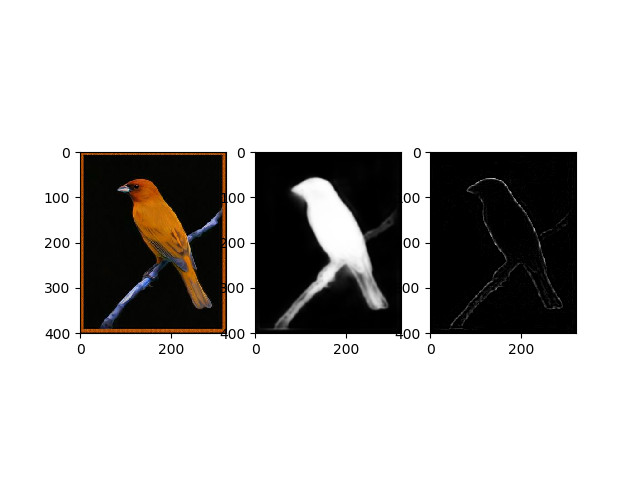

# cvpr2019_Pyramid-Feature-Attention-Network-for-Saliency-detection

Source code for our CVPR 2019 paper "Pyramid Feature Attention Network for Saliency detection" by Ting Zhao and Xiangqian Wu. ([ArXiv paper link](https://arxiv.org/abs/1903.00179))

## features

contain densecrf postprocess. thanks for [deeplab](https://github.com/DrSleep/tensorflow-deeplab-resnet/tree/crf)
